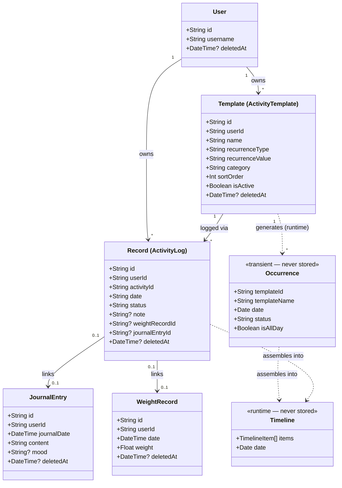
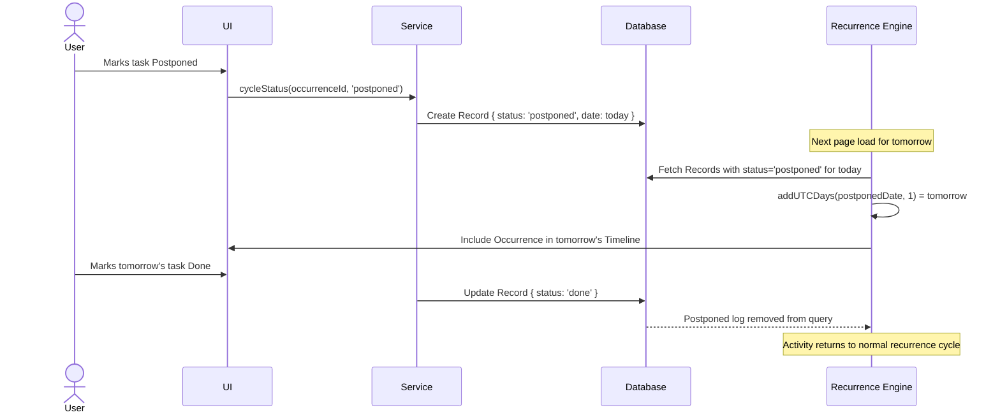

# Core Domain Specification

> **Canonical definitions** live in [SPEC.md §1](../../SPEC.md#1-domain-concepts-ubiquitous-language).  
> This document provides entity diagrams, lifecycle rules, and implementation-level detail.

---

## 1. Entity Relationship Overview

The persistent layer is built around a central Record (`ActivityLog`) that acts as the connective tissue between the recurrence engine and all domain-specific artifacts.



---

## 2. Entity Definitions & Lifecycle Rules

### A. Template (ActivityTemplate)

**Role**: Persistent blueprint for a recurring or one-time scheduled activity.

**Key fields**:
- `recurrenceType`: `daily | weekly | monthly | yearly | custom | milestone`
- `recurrenceValue`: JSON array or cron-style string for custom intervals
- `sortOrder`: User-managed integer controlling Timeline position
- `isActive`: Soft-disable without deleting

**Lifecycle**:
```
Created → Active → Paused (isActive=false) → Soft-Deleted (deletedAt set)
```

**Rules**:
- Templates are never deleted hard. Set `deletedAt`.
- A Template produces Occurrences for any given date via `lib/recurrence.ts`.
- The Timeline sort order is user-controlled via drag-and-drop, persisted as `sortOrder`.

---

### B. Occurrence

**Role**: Transient runtime representation of a Template evaluated for a specific date.

**Key properties**: computed from the Template's recurrence rules by `lib/recurrence.ts` and `lib/services/TimelineService.ts`.

**Rules**:
- Occurrences are **never persisted**. They are computed on every request.
- An Occurrence has no primary key.
- When a user acts on an Occurrence, a `Record` is created. The Occurrence does not transform — it remains transient.

---

### C. Record (ActivityLog)

**Role**: Persistent, immutable fact that the user interacted with an Occurrence on a specific date.

**Status values**: `done | skipped | postponed | paid | renewed`

**Artifact links** (at most one per Record):
- `journalEntryId` → links to a `JournalEntry`
- `weightRecordId` → links to a `WeightRecord`

**Lifecycle**:
```
Created (on first interaction) → Status Updated → Soft-Deleted (if interaction reversed)
```

**Rules**:
- Records with `deletedAt` set are excluded from all queries via `where: { deletedAt: null }`.
- When a Record is created for a Journal or Weight action, the Timeline automatically shows that item as completed for that day.
- When a non-daily Occurrence is marked `postponed`, the recurrence engine detects that Record and moves the next occurrence to the following day.

---

### D. Timeline (Runtime)

**Role**: The ordered list of everything happening on a specific day.

**Assembly sources**:
1. **Template Occurrences** — recurrence engine output for templates due on that day.
2. **External Events** — fetched from Provider integrations (Google Calendar).
3. **Orphaned Records** — logs from days they were not originally scheduled (e.g. spontaneous weight entries).

**Ordering**:
- Timed items ordered by start time.
- All-day items appear at the top.
- Manual `sortOrder` overrides are respected via `manualOrderIds` client state.

---

## 3. The Postpone Mechanics

Postponing is one of the most subtle behaviors in Tracker. The rules:



**Daily activity rule**: Activities with `recurrenceType: 'daily'` skip the `postponed` state entirely. Their cycle is:
`Cleared → Done → Canceled → Cleared`

---

## 4. The Activity-First Architecture

Every domain module (Journal, Weight, Leave, future Workouts) integrates with the Timeline through a shared pattern:

```
Domain Action (e.g. saveJournalEntry)
        ↓
1. Save the domain artifact (JournalEntry, WeightRecord)
        ↓
2. Get or create the default Template for this type
   ActivityService.getOrCreateDefaultTemplate(userId, 'JOURNAL', ...)
        ↓
3. Create a Record linked to the artifact
   ActivityService.logActivity({ status: 'done', journalEntryId: entry.id })
        ↓
4. Timeline automatically shows this item as completed for the day
```

This architecture means no module needs to know how the Timeline works. They just create Records. The Timeline assembles itself.

---

## 5. Capabilities Matrix

See [SPEC.md §4](../../SPEC.md#4-capabilities-by-module) for the full capabilities matrix per module.

---

## 6. Ownership Rules

1. A `User` owns all their `Templates`, `Records`, `JournalEntries`, `WeightRecords`, and `Integrations`.
2. A `Template` owns its `Records` (FK: `activityId`).
3. A `Record` optionally owns one domain artifact (`JournalEntry` or `WeightRecord`).
4. External `Events` (from Providers) are owned by nobody in the database — they are transient.

---

## See Also

| Document | What it covers |
|---|---|
| [SPEC.md](../../SPEC.md) | Precise domain definitions and invariants |
| [Philosophy.md](./Philosophy.md) | Product vision and the three-layer model |
| [architecture.md](../02-architecture/architecture.md) | Request flow and dependency rules |
| [Timeline Pattern.md](../09-patterns/Timeline%20Pattern.md) | How to implement Timeline-integrated features |
| [Audit Pattern.md](../09-patterns/Audit%20Pattern.md) | How to add audit trails to new modules |
