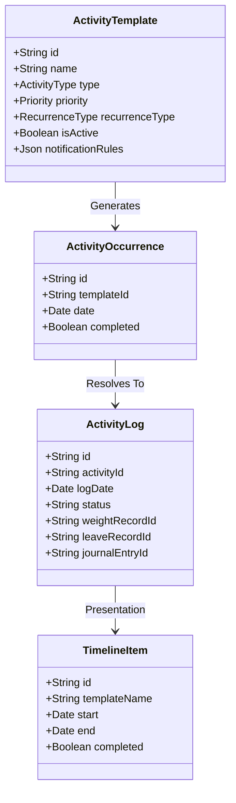

# Tracker OS — Core Domain Specification

This document establishes the official domain model, terminology, and data ownership rules of Tracker OS. Every module, server action, and synchronization pipeline must strictly adhere to these definitions.

---

## 1. Domain Entities & Value Objects

### A. ActivityTemplate
- **Definition**: The persistent blueprint describing a recurring or one-time target.
- **Fields**: Contains recurrence rules (`recurrenceType`, `interval`, `daysOfWeek`), priority, estimated duration, category, and type.
- **Source of Truth**: The local Postgres database.

### B. ActivityOccurrence
- **Definition**: The transient runtime instance of a template evaluated for a specific calendar day.
- **Rule**: Occurrences are **never** stored in the database. Storing future instances is prohibited to prevent data sync mismatch or drift.

### C. ActivityLog
- **Definition**: The persistent record of a user transaction (done, skipped, etc.) on an occurrence.
- **Rule**: All domain modules (Weight, Leave, Journal, etc.) must link their data entries to `ActivityLog` to enforce the Activity-first architecture.

### D. TimelineItem
- **Definition**: The unified presentation model for client interfaces, merging calendar provider occurrences and local template occurrences.

### E. Reminder & Notification
- **Reminder**: Setting defining when alerts are triggered.
- **Notification**: Transient alert dispatched to the user.

### F. Provider & Integration
- **Provider**: Adapter interface (e.g. `ICalendarProvider`) connecting external calendars (Google, Outlook, etc.).
- **Integration**: Local connection credentials and configuration settings.

---

## 2. Ownership & Source of Truth Rules

1. **Google Calendar as External Source of Truth**:
   - Google Calendar events are queried dynamically and cached transiently. The local database stores only links/sequence mappings, never copy records of events.
2. **Local Database as Core Domain Source of Truth**:
   - Templates, completion logs, journal notes, leaves, and weights are owned entirely by the local database.

---

## 3. The Activity Lifecycle

1. **Creation**: User creates an `ActivityTemplate` (e.g., "Daily Journal").
2. **Evaluation**: When loading the page, the `TimelineService` evaluates the template's recurrence rules and outputs a transient `ActivityOccurrence` for today.
3. **Execution**: The user clicks the checkbox or logs a journal entry. This triggers `ActivityService` to commit an `ActivityLog` to the database.
4. **Synchronization**: The event bus publishes an `ACTIVITY_COMPLETED` event, triggering the `ProviderService` to sync completion tags to external calendar slots.
