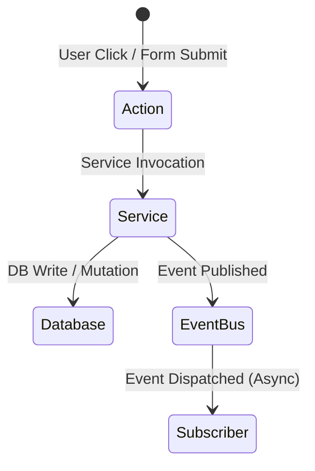

# Tracker OS — System Architecture (Frozen v1.0)

This document represents the finalized, frozen system architecture blueprint of Tracker OS. No core architectural changes or domain boundary shifts are permitted after this document is signed off.

---

## 1. Modular Context Separation

All codebase features reside under isolated domain structures:

- **`modules/core/`**: Auth, Calendar layouts, Command palettes, Dashboards, Search indices, Audit services.
- **`modules/life/`**: Journal notes, leave records, weight metrics, secure documents, and wishlist trackers.
- **`modules/sync/`**: Sync adapters and credentials matching.

---

## 2. Core Domain Services & Abstractions

Every domain action executes through a dedicated service:

- **ActivityService**: Master ledger controller. It is the **only writer** to the `ActivityLog` database table.
- **TimelineService**: Dynamic timeline compiler. It runs at request-time to merge calendar events, active schedules, and local completions.
- **ProviderService**: Generic abstract layer for integrations (Google, Outlook, LeetCode, GitHub, etc.) utilizing provider registries.
- **InsightsService**: Analytics aggregator (streaks, averages, usage progress, metric deltas).
- **SearchService**: Global text search indexing across activities, logs, and journal entries.
- **NotificationService**: Trigger dispatcher based on template alerts.
- **AuditService**: Writes history and changes to the system ledger.

---

## 3. Communication Patterns

1. **Synchronous**: Actions call Services, Services call database drivers.
2. **Asynchronous**: Cross-module changes propagate via the isolated `DomainEventBus`.
3. **Data Integrity**: Modules utilize foreign key relations on `ActivityLog` to map records.
