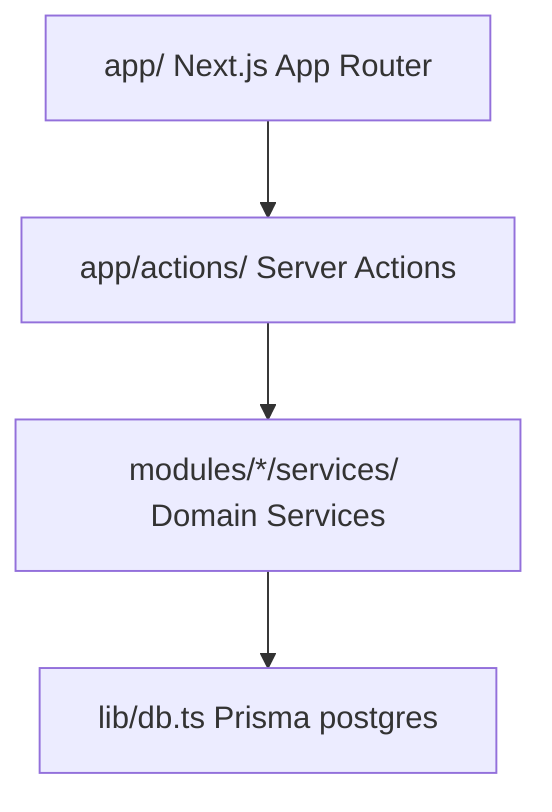

# Tracker OS — Dependency & Boundary Rules

This document establishes the architecture boundaries, dependency constraints, and package/import rules of Tracker OS. These rules prevent coupling and ensure codebase modularity.

---

## 1. Modular Architecture Boundaries

### A. Layer Definitions
1. **Presentation Layer (`app/` / `components/`)**:
   - Next.js Server Components, Client Components, and styling primitives.
   - Restricting direct database reads or complex business transformations.
2. **Orchestration Layer (`app/actions/`)**:
   - Thin server actions. They are entry points for forms and client fetches.
   - **Rule**: Server actions must delegate to domain services immediately rather than implementing transaction logic.
3. **Domain Layer (`modules/*/services/` / `lib/services/`)**:
   - Contains domain service logic, validation, recurrence matching, and event dispatching.
4. **Data Access Layer (`lib/db.ts`)**:
   - Direct prisma database context.

---

## 2. Module Communication Rules

To prevent spaghetti references, cross-module updates must follow strict rules:

1. **Service Interfaces**:
   - A module (e.g., `Leave`) can query another module (e.g., `Activity`) only by calling public methods on the destination module's Service (`ActivityService`). Direct database queries across domain schemas are forbidden.
2. **Event-Driven Coupling (DomainEventBus)**:
   - When a state change happens (e.g., Leave requested), the module must publish a domain event (`ACTIVITY_CREATED`). Other modules listen and react asynchronously.
3. **Circular Import Prevention**:
   - Do not import index barrels (`index.ts`) across modules. Import directly from specific files (e.g. `@/modules/sync/google-calendar/providers/GoogleCalendarProvider`) to prevent circular compiler errors.
