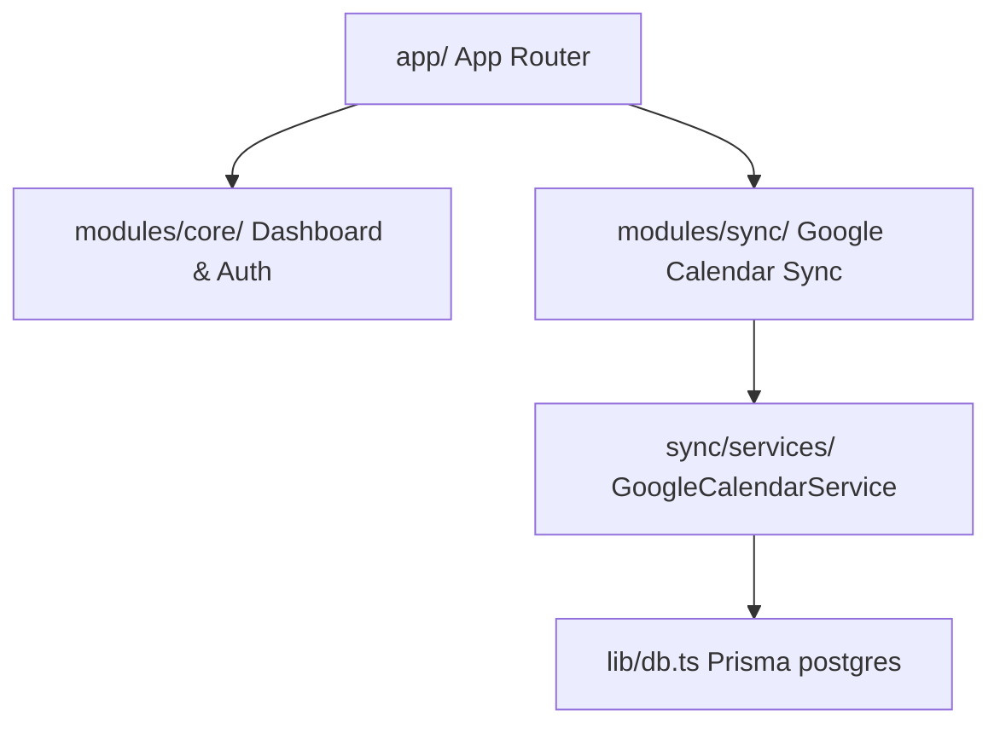
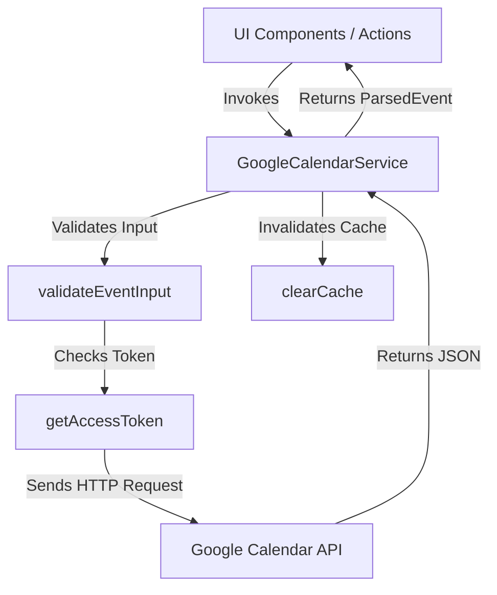
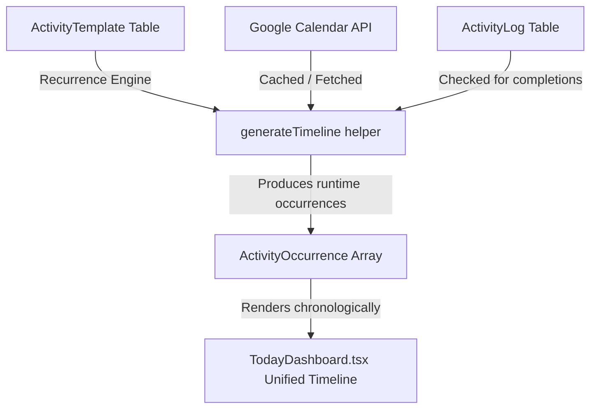

# Tracker OS – System Architecture Blueprint

This document details the code boundaries, scheduling infrastructures, and data sync layers of Tracker OS.

---

## 1. Domain-Driven Modular Boundaries

The codebase is organized into isolated domain folders to preserve scaling limits.

### Code Dependencies Flow

### Module Interfaces Rules
1. **Views vs. Actions**:
   * Client-side React components reside under `components/` folders within the module. They trigger page renders or call server actions.
   * Business transactions and data queries reside inside `services/` folder classes.
2. **Barrel Exports**:
   * Public exports are registered in `index.ts`.
   * **Rule**: Server-only service classes (which import database drivers or Node file systems) must never be exported from index files imported by client components.

---

## 2. Abstraction Layer Standards & Shared Domain Services

To support modularity and prevent direct component-to-database dependency leaks, all core operations are segregated:

### A. Database Access
* UI components and presentation layers never query Prisma directly. All queries are handled through thin actions delegating to domain services.

### B. Shared Domain Services
Tracker OS isolates reusable transaction rules into standard service blocks:
- **ActivityService**: Master ledger controller. It is the **only writer** to the `ActivityLog` table.
- **TimelineService**: Dynamic timeline occurrences generator.
- **ProviderService**: Unified abstraction proxy for integration synchronization.
- **InsightsService**: Streaks, leaves, and weights analytics generator.
- **SearchService**: Search queries indexer.
- **AuditService**: System security history logger.
- **NotificationService**: Trigger rules evaluator.

### C. Resilient Domain Event Bus
* The stateless `DomainEventBus` notifies subscribers asynchronously when data mutations happen.
* **Resiliency**: Subscribers are isolated using try-catch blocks during callback iterations. Failure in one subscriber does not disrupt other subscribers or crash the server action transaction.
* **Observability**: A unique `traceId` is attached to every published event payload, creating traceable telemetry logs for debugging event propagation.

---

## 3. Google Calendar Sync Architecture

The scheduling backbone coordinates between Google Calendar APIs and Tracker logs.

### A. Authentication & Offline Access
* **Scope Upgrade**: Tracker requests offline scopes (`access_type=offline`) during Google authentication.
* **Persistent refresh_token**: The decrypted `refresh_token` is stored securely at-rest using **AES-256-GCM** encryption keys.
* **Transient access_token**: The app does not save Google access tokens. It fetches a temporary token on-demand using the refresh token, caching it in-memory (`accessTokenCache`) until it expires.

### B. Caching & Write-Through Pipeline
- **In-Memory Cache (calendarCache)**: Fetched schedule lists are cached in-memory for 10 minutes to prevent API rate-limiting spikes.
- **Write-Through Cache Invalidation**: When a write operation (`createEvent`, `updateEvent`, `deleteEvent`) completes successfully:
  1. The API call is processed and sent directly to Google Calendar.
  2. The local in-memory cache (`calendarCache`) for that user is immediately cleared (`clearCache(userId)`).
  3. Subsequent reads are forced to fetch fresh data, implementing a reliable **Write-Through, Cache-Aside** pattern.

---

## 4. Google Calendar Write & CRUD Architecture

Tracker acts as a proxy for all calendar modifications, ensuring that third-party modules never communicate with Google APIs directly.

### A. Operations Flow

### B. Input Validation Rules
- **Summary**: Required for new events; maximum length 255 characters.
- **Start & End Times**: Start time must be strictly before the end time.
- **All-Day Events**: Must specify `start.date` and `end.date` in `YYYY-MM-DD` format. Timezones are ignored.

### C. Error Recovery & Idempotency
- **404 / 410 (Already Deleted)**: If updating or deleting an event returns `404 Not Found` or `410 Gone` from Google's API:
  - **Update**: Propagates a clean error indicating the event no longer exists.
  - **Delete**: Handled as a success (`true`) to guarantee that delete operations are **idempotent** and do not crash on duplicate clicks.

---

## 5. Synchronization & Conflict Resolution Strategy

Since Tracker does not store a local copy of events in the database, **Google Calendar remains the absolute single source of truth**.

- **Simultaneous Edits**: Google Calendar handles sequence numbers and revision tags internally. All updates are sequential PATCH requests.
- **Deleted Events**: Removed from the client immediately on cache invalidation.
- **Recurring Events**: Handled as individual occurrences via expansion (`singleEvents=true`). Updates to individual occurrences are supported by referencing the occurrence's specific ID.
- **All-Day Events**: Stored with date boundaries, ignoring UTC offset shifts, preventing day-shifting bugs.

---

## 6. Today Dashboard & Unified Timeline Architecture (v2.1 Specification)

The Tracker home dashboard (`/` route) acts as a unified daily control center. Rather than separating widgets by modules (e.g. habits, workouts, meetings), a single chronological **Today's Timeline** is generated at runtime.

### A. Core Workflow & Unified Scheduler

### B. Decoupled Extensions Flow
Specialized domains (Journal, Leave, Weight) are decoupled from scheduling:
- Reminders for logging weight, writing journals, or leave reminders are scheduled as standard `ActivityTemplates`.
- When completed, the `ActivityLog` links back to specialized tables (`WeightRecord`, `LeaveRecord`, `JournalEntry`) using nullable unique foreign keys (`weightRecordId`, `leaveRecordId`, `journalEntryId`).

### C. Capability-Driven Logic
Instead of hardcoding category checks, templates declare capabilities dynamically:
- `COMPLETABLE`: Requires an explicit checkbox tick to complete.
- `SCHEDULABLE`: Has a duration and appears on the calendar timeline.
- `CALENDAR_SYNC`: Synchronizes to Calendar Providers (`GOOGLE`, `APPLE`, etc.).
- `LOCATION_AWARE`: Contains physical locations or meeting join URLs.
- `QUANTIFIABLE`: Requires numeric input (e.g. billing amounts).

---

## 7. Navigation, Command Palette, & Side Drawer Architecture

To prevent implementation leaking into the UI, navigation and details viewers utilize decoupled structural systems:
* **Sidebar Layout**: A simplified 7-tab sidebar navigation representing core user modules: Today, Calendar, Activities, Journal, Leave Tracker, Secure Vault, and Settings.
* **Ctrl+K Command Palette**:
  - The `CommandPalette` component intercepts global keyboard event loops via `Ctrl + K`.
  - Commands are mapped dynamically (e.g. `New Activity` launches the progressive wizard, `Go to Calendar` switches the active tab, etc.).
  - Search queries filter commands case-insensitively, and keyboard arrows allow navigating list indices with active indicators.
* **Sliding Right-Side Day Drawer**:
  - Rather than opening standard popup modal overlays on day-clicks, a right-side sliding panel drawer `DayLogsModal` is used.
  - The drawer stays mounted on the side while the user clicks other days on the calendar grid. It listens to changes in the active date string (`dateStr`) and note records via React `useEffect` hooks to dynamically reload day data without close-and-open transitions.
* **Modal Portals**: Modals are handled inside React client state loops. They mount `<Modal>` wrappers from the design system, locking body scrolling and listening to general event loops (e.g. ESC key) automatically.

