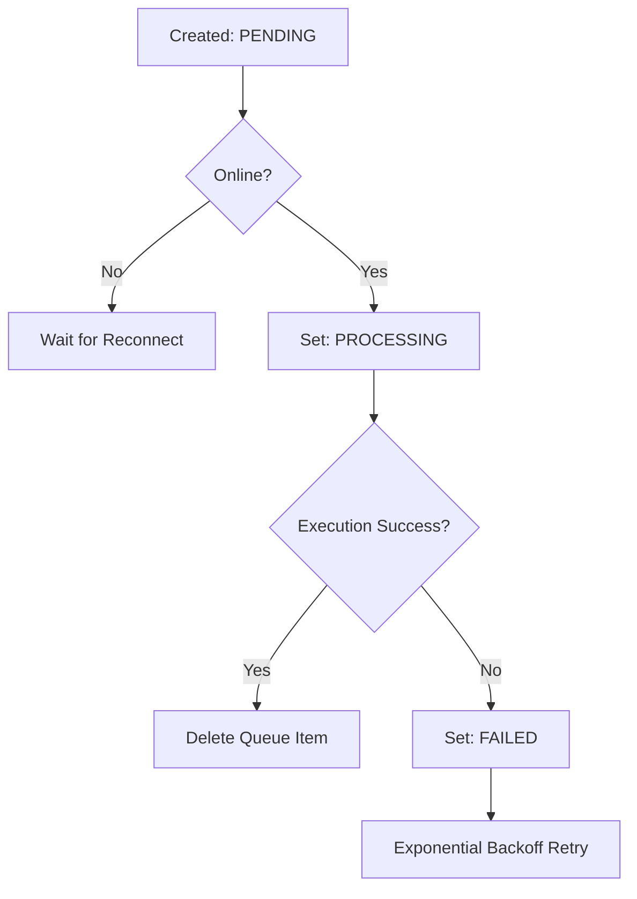

# Offline-First Development & Module Migration Guide

This guide explains how to migrate a tracker module to the local-first, offline-capable architecture using the generic repository framework.

## Architecture Overview

All client-side components interact with a domain coordinator Repository. The coordinator handles atomic writes to local IndexedDB and queues synchronization transactions for server replays when online.

```
React Store (Zustand)
       │
       ▼
[Domain]Repository (Coordinating Wrapper)
       ├── Local[Domain]Repository (IndexedDB writes + Sync Queue enqueues)
       └── Remote[Domain]Repository (Server Actions communication)
```

## Step-by-Step Module Migration

To migrate a new module (e.g. `Weight`), perform the following steps:

### 1. Update Database Schemas
Add the new object store definition to [schema.ts](file:///d:/github_projeccts/tracker/lib/database/local/schema.ts) under the `STORES` configuration:
```typescript
{
  name: 'weight_records',
  keyPath: 'id',
  indexes: [
    { name: 'date', keyPath: 'date', unique: false }
  ]
}
```

### 2. Define Repository Contracts
Create the interfaces file under `modules/weight/repository/IWeightRepository.ts`:
```typescript
import { IRepository } from '@/lib/database/repository/IRepository';
import { WeightRecord } from '@/types';

export interface IWeightRepository extends IRepository<WeightRecord> {
  // Add domain-specific query methods here
}
```

### 3. Implement Local Repository
Inherit from `BaseLocalRepository` in `modules/weight/repository/LocalWeightRepository.ts`:
```typescript
import { BaseLocalRepository } from '@/lib/database/repository/BaseRepository';
import { WeightRecord } from '@/types';
import { IWeightRepository } from './IWeightRepository';

export class LocalWeightRepository 
  extends BaseLocalRepository<WeightRecord> 
  implements IWeightRepository 
{
  constructor() {
    super('weight_records');
  }
}
```

### 4. Implement Remote Repository
Inherit from `BaseRemoteRepository` in `modules/weight/repository/RemoteWeightRepository.ts`:
```typescript
import { BaseRemoteRepository } from '@/lib/database/repository/BaseRepository';
import { WeightRecord } from '@/types';
import { createWeightAction, deleteWeightAction } from '@/app/actions/weight';

export class RemoteWeightRepository extends BaseRemoteRepository<WeightRecord> {
  public async create(entity: WeightRecord) {
    return createWeightAction(entity);
  }
  public async update(id: string, entity: Partial<WeightRecord>) {
    // Call server update action
  }
  public async delete(id: string) {
    return deleteWeightAction(id);
  }
}
```

### 5. Create Coordinator Repository
Inherit from `BaseRepository` in `modules/weight/repository/WeightRepository.ts`:
```typescript
import { BaseRepository } from '@/lib/database/repository/BaseRepository';
import { WeightRecord } from '@/types';
import { LocalWeightRepository } from './LocalWeightRepository';

export class WeightRepository extends BaseRepository<WeightRecord> {
  constructor() {
    super(new LocalWeightRepository(), 'weight_records');
  }
}
```

### 6. Register Background Sync Handlers
Add the sync consumer callback to the `SyncEngine` constructor in [SyncEngine.ts](file:///d:/github_projeccts/tracker/lib/database/sync/SyncEngine.ts):
```typescript
this.registerHandler('weight_records', async (op, payload) => {
  const { RemoteWeightRepository } = await import('@/modules/weight/repository/RemoteWeightRepository');
  const remote = new RemoteWeightRepository();
  if (op === 'CREATE') return remote.create(payload);
  if (op === 'UPDATE') return remote.update(payload.id, payload);
  return remote.delete(payload.id);
});
```

### 7. Hook into React Store
Initialize local data loading on mount and replace legacy server action calls inside [store.tsx](file:///d:/github_projeccts/tracker/lib/store/store.tsx) with the coordinating `WeightRepository`.

---

## Sync & Queue Lifecycles

### 1. Repository Lifecycle
1. **Request Write**: Coordinator initiates save.
2. **Atomic Tx**: `BaseLocalRepository` saves the entity and enqueues a `SyncQueueItem` in a single atomic transaction.
3. **Optimistic UI**: React store state updates immediately.
4. **Trigger Sync**: SyncEngine is prompted to check online connectivity.

### 2. Queue Lifecycle


---

## Testing Checklist & Pitfalls

### Common Pitfalls
* **Duplicate Handler Registration**: Re-registering handlers on multiple instantiations of the SyncEngine singleton will discard previous registrations. Ensure registration occurs during class construction only.
* **Uncached State Out-of-Sync**: Updating local IndexedDB without notifying the Zustand store can cause UI lag. Ensure write operations trigger state update callbacks.

### Validation Checklist
- [ ] Record created offline survives page reload.
- [ ] Sync queue persists on browser close.
- [ ] Network disconnect yields failure retry state.
- [ ] Reconnecting automatically replays mixed-domain queue items in FIFO order.
- [ ] Backup payload verifies correctly.
